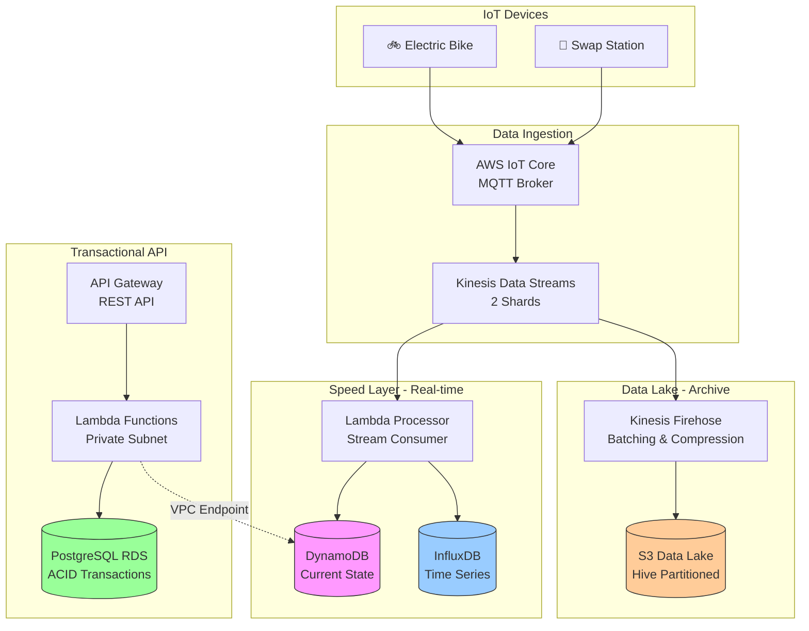

# EcoVolt - Electric Bike Battery Swapping Platform

> Production-ready AWS infrastructure and applications for EcoVolt's electric bike battery swapping network in Ghana

[](https://www.terraform.io/)
[](https://aws.amazon.com/)
[](https://reactnative.dev/)
[](https://www.python.org/)
[](scripts/testing/)

## 📋 Overview

EcoVolt is a comprehensive battery swapping platform for electric motorcycles in Ghana. The system enables riders to quickly swap depleted batteries for fully charged ones at strategically located swap stations across Accra and other major cities.

**Infrastructure Status**: ✅ **Production-Ready** | 359 AWS Resources | 100% Test Pass Rate

### Key Features

- **Real-time Station Finder** - Locate nearby swap stations with live battery availability
- **Quick Battery Swaps** - Complete battery exchanges in under 2 minutes
- **Mobile Wallet** - Integrated payment system with Mobile Money support
- **Fleet Management** - Admin portal for managing stations, bikes, and operations
- **IoT Integration** - Real-time telemetry from bikes and stations via AWS IoT Core
- **Analytics Dashboard** - Comprehensive business intelligence and reporting
- **Data Lake** - Historical telemetry archive in S3 with Hive partitioning

### System Architecture

The EcoVolt platform implements a **Polyglot & Fan-Out Architecture** optimized for cost and performance:



**Architectural Highlights:**
- **No NAT Gateway** - VPC Endpoints + Terraform secret injection saves $40+/month
- **Polyglot Persistence** - Right database for each workload saves $110/month
- **Fan-Out Pattern** - Single Kinesis stream feeds multiple consumers
- **Serverless-First** - Pay-per-use with automatic scaling

See [PROJECT_MASTER_REPORT.md](PROJECT_MASTER_REPORT.md) for comprehensive architecture documentation.

## 🏗️ Platform Components

### 1. Backend API
- **Technology**: Python 3.11, AWS Lambda, API Gateway
- **Database**: PostgreSQL (RDS), DynamoDB, InfluxDB
- **Authentication**: AWS Cognito with JWT tokens (offline verification)
- **Features**: 38+ REST API endpoints for all operations
- **Deployment**: Private subnet with VPC endpoints (no NAT)

### 2. Mobile Application
- **Technology**: React Native Expo, TypeScript, Redux Toolkit
- **Platforms**: iOS and Android
- **Features**: Station finder, swap flow, wallet, bike monitoring, push notifications
- **Authentication**: Cognito User Pools with secure token storage

### 3. Admin Portal
- **Technology**: React + Vite, TypeScript, Material-UI
- **Deployment**: S3 + CloudFront CDN
- **Features**: Dashboard, station management, bike fleet, user management, analytics
- **URL**: [https://admin.ecovolt-dev.com](https://dev-admin.ecovolt.thekloudwiz.com/)

### 4. IoT Infrastructure
- **AWS IoT Core**: MQTT broker for device telemetry
- **Kinesis Data Streams**: Event streaming backbone (2 shards)
- **Real-time Processing**: Lambda consumers for state updates
- **Data Lake**: Kinesis Firehose → S3 (GZIP compressed, Hive partitioned)
- **Time Series**: Timestream for InfluxDB (historical metrics)

### 5. Infrastructure
- **Cloud Provider**: AWS (eu-central-1 Frankfurt)
- **IaC**: Terraform with modular architecture
- **Resources**: 359 AWS resources deployed
- **CI/CD**: GitHub Actions with OIDC (no long-lived credentials)
- **Automation**: Terraform outputs → GitHub secrets (zero manual config)

## 📚 Documentation

### Core Documentation

| Document | Description |
|----------|-------------|
| **[Master Report](PROJECT_MASTER_REPORT.md)** | 📊 Executive summary, architecture, portfolio guide |
| **[Architecture](docs/ARCHITECTURE.md)** | System architecture and design decisions |
| **[Infrastructure](docs/INFRASTRUCTURE.md)** | AWS infrastructure setup and Terraform modules |
| **[Backend](docs/BACKEND.md)** | Backend API documentation and implementation |
| **[Frontend](docs/FRONTEND.md)** | Mobile app and admin portal documentation |
| **[Cost Estimation](docs/COST_ESTIMATION.md)** | Detailed cost analysis and optimization |
| **[GitHub Secrets Automation](docs/GITHUB_SECRETS_AUTOMATION.md)** | Automated secret management from Terraform |
| **[Scripts Analysis](SCRIPTS_COMPREHENSIVE_REPORT.md)** | Testing scripts deep-dive and best practices |

### Quick Links

- [API Documentation](docs/BACKEND.md#api-endpoints)
- [Deployment Guide](docs/INFRASTRUCTURE.md#deployment)
- [Mobile App Setup](docs/FRONTEND.md#mobile-application)
- [Admin Portal Setup](docs/FRONTEND.md#admin-portal)
- [Testing Suite](scripts/testing/README.md)
- [Troubleshooting](docs/INFRASTRUCTURE.md#troubleshooting)

## 🚀 Quick Start

### Prerequisites

- AWS Account with appropriate permissions
- Terraform >= 1.5
- Node.js >= 18
- Python >= 3.11
- AWS CLI configured
- GitHub CLI (`gh`) for secret automation

### 1. Clone Repository

```bash
git clone https://github.com/thekloudwiz-org/project-ecovolt.git
cd project-ecovolt
```

### 2. Deploy Infrastructure

```bash
cd infra

# Initialize Terraform
terraform init

# Plan deployment
terraform plan -var-file=dev.tfvars -out=dev.tfplan

# Apply infrastructure
terraform apply dev.tfplan

# GitHub secrets are automatically updated after apply
# via scripts/update-github-secrets.sh
```

**Note**: The Terraform apply workflow automatically updates GitHub repository secrets with new infrastructure values (API Gateway URL, Cognito IDs, S3 buckets, etc.). No manual configuration needed!

### 3. Deploy Backend

Backend Lambda functions are automatically deployed via the Terraform compute module. For manual deployment:

```bash
cd application/backend
./scripts/package_lambdas.sh
# Lambdas are packaged and uploaded by Terraform
```

### 4. Deploy Admin Portal

Admin portal is deployed automatically via GitHub Actions on push to `dev` branch:

```bash
# Trigger deployment by pushing to dev branch
git push origin dev

# Or deploy manually:
cd application/admin-portal
npm install
npm run build
aws s3 sync ./dist s3://ecovolt-dev-admin-portal/ --delete
aws cloudfront create-invalidation --distribution-id <ID> --paths "/*"
```

Environment variables are automatically injected from GitHub secrets during build.

### 5. Run Mobile App (Development) - Yet to be implemented

```bash
cd application/mobile/EcoVolt
npm install
npx expo start
```

Scan QR code with Expo Go app to run on device.

### 6. Run Admin Portal (Local Development)

```bash
cd application/admin-portal
npm install

# Create .env file with correct values
cp .env.example .env
# Edit .env with values from Terraform outputs

npm run dev
```

Access at http://localhost:5173

## 📊 System Metrics

### Current Deployment (Development Environment)

- **Region**: EU Central 1 (Frankfurt)
- **Availability**: Multi-AZ ready
- **Total AWS Resources**: 359 resources
- **API Gateway**: https://mxc55kr3d8.execute-api.eu-central-1.amazonaws.com/v1
- **Admin Portal**: S3 + CloudFront distribution
- **Test Pass Rate**: ✅ **100%** (5/5 phases)
- **System Latency**: < 3 seconds end-to-end
- **Lambda Success Rate**: 100% (0 errors, 0 throttles)

### Infrastructure Resources Breakdown

| Category | Count | Key Services |
|----------|-------|--------------|
| **Networking** | ~50 | VPC, Subnets, VPC Endpoints, Security Groups |
| **Compute** | ~40 | Lambda Functions, API Gateway, Event Source Mappings |
| **Storage** | ~30 | DynamoDB Tables, S3 Buckets, RDS Instance |
| **Security** | ~45 | IAM Roles/Policies, KMS Keys, Cognito User Pools |
| **IoT & Streaming** | ~25 | IoT Core, Kinesis Streams, Firehose |
| **Monitoring** | ~35 | CloudWatch Alarms, SNS Topics, Log Groups |
| **Content Delivery** | ~15 | CloudFront Distributions, Route53 Records |
| **Other** | ~119 | SSM Parameters, Secrets, Tags, etc. |

### Cost Estimates

| Environment | Traditional Cost | EcoVolt Cost | Savings |
|-------------|-----------------|--------------|---------|
| Development | $200/month | **$90/month** | **$110/month (55%)** |
| Staging | $1200/month | $800-1000/month | $200-400/month |
| Production | $4000/month | $2500-3500/month | $500-1500/month |

**Cost Optimizations Implemented:**
1. **No NAT Gateway** ($40+/month saved) - VPC Endpoints for AWS services
2. **Polyglot Persistence** ($110/month saved) - Right database for each use case
3. **Serverless-First** - Pay-per-use vs always-on servers
4. **DynamoDB On-Demand** - No over-provisioning
5. **S3 Lifecycle Policies** - Automatic archival to Glacier

See [Cost Estimation](docs/COST_ESTIMATION.md) for detailed breakdown.

## 🔒 Security

- ✅ Encryption at rest (KMS for all data stores)
- ✅ Encryption in transit (TLS 1.2+ enforced)
- ✅ JWT authentication with offline verification (no NAT needed)
- ✅ Role-based access control (Admin vs Customer vs System)
- ✅ AWS Secrets Manager (RDS credentials, API keys)
- ✅ Parameter Store (encrypted configuration)
- ✅ GuardDuty monitoring (threat detection)
- ✅ CloudTrail audit logging (all API calls)
- ✅ Private subnets with VPC endpoints (no internet exposure)
- ✅ Security Groups with least privilege

## 🧪 Testing

### Comprehensive Test Suite

```bash
# Full system verification (end-to-end)
cd scripts/testing
python3 full_system_verification.py

# Test Results: ✅ 5/5 Phases (100% Pass Rate)
# 1. IoT Injection ✅
# 2. State Layer (DynamoDB) ✅
# 3. History Layer (InfluxDB) ✅
# 4. Data Lake (S3) ✅
# 5. API Health Check ✅
```

### Individual Component Tests

```bash
# Test 1: API Gateway connectivity
./scripts/testing/01-test-api-gateway.sh

# Test 2: Cognito authentication
./scripts/testing/02-test-cognito.sh

# Test 3: DynamoDB access
./scripts/testing/03-test-dynamodb.sh

# Test 4: IoT Core publishing
./scripts/testing/04-test-iot.sh

# Test 5: End-to-end verification
./scripts/testing/05-run-complete-test.sh

# IoT Device Simulator
python3 scripts/testing/iot_device_simulator.py
```

**Latest Test Results:**
```
✅ SYSTEM VERIFICATION SUCCESSFUL
━━━━━━━━━━━━━━━━━━━━━━━━━━━━━━━━━━━━━━━━
Tests Passed: 5/5
Pass Rate: 100.0%
Latency: < 3 seconds
Failures: 0
━━━━━━━━━━━━━━━━━━━━━━━━━━━━━━━━━━━━━━━━
```

See [Testing Documentation](scripts/testing/README.md) for comprehensive test suite analysis.

## 📦 Project Structure

```
.
├── README.md                          # This file
├── PROJECT_MASTER_REPORT.md           # 📊 Comprehensive portfolio documentation
├── SCRIPTS_COMPREHENSIVE_REPORT.md    # Testing scripts analysis
│
├── docs/                              # Documentation
│   ├── ARCHITECTURE.md                # System architecture
│   ├── INFRASTRUCTURE.md              # AWS infrastructure
│   ├── BACKEND.md                     # Backend API docs
│   ├── FRONTEND.md                    # Frontend apps docs
│   ├── COST_ESTIMATION.md             # Cost analysis
│   ├── GITHUB_SECRETS_AUTOMATION.md   # CI/CD automation
│   └── architecture.webp              # Architecture diagram
│
├── infra/                             # Terraform infrastructure
│   ├── main.tf                        # Root module
│   ├── outputs.tf                     # Infrastructure outputs
│   ├── dev.tfvars                     # Development config
│   ├── staging.tfvars                 # Staging config
│   └── prod.tfvars                    # Production config
│
├── modules/                           # Terraform modules
│   ├── networking/                    # VPC, subnets, endpoints
│   ├── compute/                       # Lambda, API Gateway
│   ├── database/                      # RDS, DynamoDB
│   ├── iot/                           # IoT Core, rules
│   ├── analytics/                     # Kinesis, Firehose
│   ├── cognito/                       # User authentication
│   ├── admin_portal/                  # S3, CloudFront
│   ├── content_delivery/              # Static assets
│   ├── dns/                           # Route53, ACM
│   ├── monitoring/                    # CloudWatch, SNS
│   ├── security/                      # KMS, Secrets
│   └── ssm/                           # Parameter Store
│
├── application/                       # Application code
│   ├── backend/                       # Python Lambda functions
│   │   ├── functions/                 # API handlers
│   │   ├── shared/                    # Shared libraries
│   │   └── scripts/                   # Build scripts
│   │
│   ├── mobile/                        # React Native app
│   │   └── EcoVolt/                   # Expo project
│   │       ├── src/                   # Source code
│   │       ├── app.json               # Expo config
│   │       └── package.json
│   │
│   └── admin-portal/                  # React admin portal
│       ├── src/                       # Source code
│       ├── .env.example               # Environment template
│       └── package.json
│
├── scripts/                             # Utility scripts
│   ├── update-github-secrets.sh         # 🔄 Auto-update GitHub secrets
│   ├── testing/                         # Test suite
│   │   ├── full_system_verification.py  # End-to-end tests
│   │   ├── iot_device_simulator.py      # IoT simulator
│   │   ├── 01-test-api-gateway.sh
│   │   ├── 02-test-cognito.sh
│   │   ├── 03-test-dynamodb.sh
│   │   ├── 04-test-iot.sh
│   │   ├── 05-run-complete-test.sh
│   │   └── README.md
│   └── build-lambdas.sh               # Lambda packaging
│
├── .github/workflows/                 # CI/CD pipelines
│   ├── terraform-reusable.yml         # Terraform workflow
│   ├── admin-portal-dev.yml           # Admin portal deploy
│   ├── admin-portal-staging.yml
│   ├── admin-portal-prod.yml
│   └── mobile-app.yml                 # Mobile app build
│
└── test/                              # Infrastructure tests
    └── (Terratest files)
```

## 🌍 Environments

### Development (Current)
- **Purpose**:      Development and testing
- **Cost**:         ~$90/month
- **Features**:     Single AZ, optimized resources
- **Status**:       ✅ **100% Operational**
- **API**:          https://mxc55kr3d8.execute-api.eu-central-1.amazonaws.com/v1
- **Admin Portal**: S3 + CloudFront

### Staging
- **Purpose**:      Pre-production testing
- **Cost**:         ~$800/month
- **Features**:     Multi-AZ, production-like
- **Status**:       Ready for deployment

### Production
- **Purpose**:      Live environment
- **Cost**:         ~$2500/month
- **Features**:     Full HA, multi-AZ, DR enabled
- **Status**:       Infrastructure ready, pending go-live

## 🔄 CI/CD

### Automated Workflows

**Terraform Infrastructure:**
```yaml
# .github/workflows/terraform-reusable.yml
- Terraform plan on PR
- Terraform apply on merge
- Auto-update GitHub secrets after apply ✨
- Zero manual configuration needed
```

**Frontend Deployments:**
```yaml
# Admin Portal
- Build with environment variables from GitHub secrets
- Deploy to S3
- Invalidate CloudFront cache
- Automatic on push to dev/staging/main branches

# Mobile App
- Build with Expo EAS
- Submit to App Store / Play Store
- Manual trigger workflow
```

**GitHub Secrets Automation:**
After every `terraform apply`, the following secrets are automatically updated:
- `API_URL_DEV`, `API_URL_STAGING`, `API_URL_PROD`
- `USER_POOL_ID_DEV`, `USER_POOL_CLIENT_ID_DEV`
- `MOBILE_APP_CLIENT_ID_DEV`
- `ADMIN_PORTAL_S3_BUCKET_DEV`, `ADMIN_PORTAL_CLOUDFRONT_ID_DEV`

See [GitHub Secrets Automation](docs/GITHUB_SECRETS_AUTOMATION.md) for details.

## 🎯 Engineering Highlights

### 1. No NAT Gateway Constraint
**Challenge**: Lambda functions in private subnets typically need NAT Gateway ($40+/month)
**Solution**:
- VPC Endpoints for all AWS services (DynamoDB, S3, Secrets Manager, etc.)
- Terraform injects secrets at deployment time
- Offline JWT verification for Cognito (no API calls needed)
- **Result**: $40+/month savings with same functionality

### 2. Polyglot Persistence
**Challenge**: One database doesn't fit all workloads
**Solution**:
- **PostgreSQL RDS**: ACID transactions (user wallets, payments)
- **DynamoDB**: Real-time state (bike locations, battery status)
- **InfluxDB**: Time-series metrics (telemetry history, analytics)
- **S3 Data Lake**: Long-term archive (GZIP compressed, Hive partitioned)
- **Result**: $110/month savings + optimized performance

### 3. Fan-Out Pattern
**Challenge**: Multiple consumers need same telemetry data
**Solution**:
- Single Kinesis Data Stream (2 shards)
- Path A: Lambda → DynamoDB + InfluxDB (real-time)
- Path B: Kinesis Firehose → S3 (data lake)
- **Result**: Decoupled architecture, independent scaling

### 4. Data Lake with Firehose
**Challenge**: Store 1M+ telemetry events for long-term analytics
**Solution**:
- Kinesis Firehose automatic batching (60s or 1MB)
- GZIP compression (90% size reduction)
- Hive partitioning: `year=2025/month=01/day=15/hour=10/`
- **Result**: Zero-code S3 archival, optimized for analytics

See [PROJECT_MASTER_REPORT.md](PROJECT_MASTER_REPORT.md) Section D for technical deep-dive.

## 🎓 Learning Resources

This project demonstrates production-ready patterns for:
- ✅ Serverless architecture at scale
- ✅ Infrastructure as Code with Terraform
- ✅ Event-driven architecture (IoT → Kinesis → Lambda)
- ✅ Polyglot persistence strategy
- ✅ Cost optimization techniques
- ✅ CI/CD automation with GitHub Actions
- ✅ Security best practices (encryption, IAM, VPC)
- ✅ Comprehensive testing (end-to-end verification)

## 🤝 Contributing

We welcome contributions! Please see [CONTRIBUTING.md](CONTRIBUTING.md) for guidelines.

## 📞 Support

- **Documentation**: Check [docs/](docs/) folder
- **Master Report**: [PROJECT_MASTER_REPORT.md](PROJECT_MASTER_REPORT.md)
- **Testing Guide**: [scripts/testing/README.md](scripts/testing/README.md)
- **Issues**: [GitHub Issues](https://github.com/thekloudwiz-org/project-ecovolt/issues)
- **Email**: support@ecovolt.com

## 📄 License

This project is licensed under the MIT License - see the [LICENSE](LICENSE) file for details.

## 🙏 Acknowledgments

- AWS for cloud infrastructure
- Terraform for infrastructure as code
- React Native and React communities
- Expo for mobile development platform
- The open-source community
- [Anthropic Claude](https://claude.ai) and [Kiro](https://kiro.dev/cli/) for AI-assisted development

---

**Built with ❤️ for sustainable transportation in Ghana** 🇬🇭

**Status**: ✅ Production-Ready | 359 AWS Resources | 100% Test Pass Rate | $110/month Cost Savings
