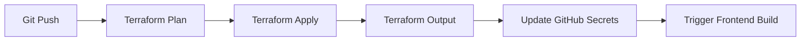
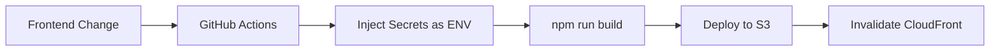

# GitHub Secrets Automation

## Overview

This document explains how GitHub secrets are automatically updated from Terraform outputs, eliminating the need for manual secret management and ensuring frontend deployments always use current infrastructure values.

## Problem Solved

Previously, when infrastructure values changed (API Gateway URL, Cognito IDs, etc.), GitHub secrets had to be manually updated for frontend builds to work correctly. This led to:

- Manual toil and potential human error
- Deployment failures due to outdated configuration
- Security risks from hardcoded values in repositories

## Solution

After every `terraform apply`, a script automatically updates GitHub repository secrets with the latest infrastructure outputs.

## How It Works

### 1. Terraform Apply Workflow

When Terraform is applied (via `.github/workflows/terraform-reusable.yml`), it:

1. Runs `terraform apply`
2. Captures Terraform outputs as JSON
3. Executes `scripts/update-github-secrets.sh`
4. Updates GitHub secrets using the GitHub CLI

### 2. Secret Naming Convention

Secrets follow this pattern: `{NAME}_{ENVIRONMENT}`

| Secret Name | Terraform Output | Usage |
|------------|------------------|-------|
| `API_URL_DEV` | `api_gateway_url` | API Gateway invoke URL |
| `USER_POOL_ID_DEV` | `user_pool_id` | Cognito User Pool ID |
| `USER_POOL_CLIENT_ID_DEV` | `admin_portal_client_id` | Admin Portal Cognito Client ID |
| `MOBILE_APP_CLIENT_ID_DEV` | `mobile_app_client_id` | Mobile App Cognito Client ID |
| `ADMIN_PORTAL_S3_BUCKET_DEV` | `admin_portal_s3_bucket` | S3 bucket for admin portal hosting |
| `ADMIN_PORTAL_CLOUDFRONT_ID_DEV` | `admin_portal_cloudfront_id` | CloudFront distribution ID |

The same pattern applies for `STAGING` and `PROD` environments.

### 3. Frontend Workflows

Frontend workflows (Admin Portal, Mobile App) reference these secrets:

```yaml
# Example: .github/workflows/admin-portal-dev.yml
secrets:
  aws_role_arn: ${{ secrets.AWS_ROLE_ARN_DEV }}
  s3_bucket: ${{ secrets.ADMIN_PORTAL_S3_BUCKET_DEV }}
  cloudfront_distribution_id: ${{ secrets.ADMIN_PORTAL_CLOUDFRONT_ID_DEV }}
  api_url: ${{ secrets.API_URL_DEV }}
  user_pool_id: ${{ secrets.USER_POOL_ID_DEV }}
  user_pool_client_id: ${{ secrets.USER_POOL_CLIENT_ID_DEV }}
```

These are automatically injected as environment variables during build:

```yaml
env:
  VITE_API_URL: ${{ secrets.api_url }}
  VITE_USER_POOL_ID: ${{ secrets.user_pool_id }}
  VITE_USER_POOL_CLIENT_ID: ${{ secrets.user_pool_client_id }}
```

## Manual Execution

If you need to manually update secrets (e.g., after manual Terraform changes):

```bash
# From repository root
export GITHUB_TOKEN="your_github_token"
export GITHUB_REPOSITORY="owner/repo"

# Update dev environment secrets
./scripts/update-github-secrets.sh dev

# Update staging environment secrets
./scripts/update-github-secrets.sh staging

# Update production environment secrets
./scripts/update-github-secrets.sh prod
```

### Prerequisites

1. **GitHub CLI installed**:
   ```bash
   # macOS
   brew install gh

   # Linux
   curl -fsSL https://cli.github.com/packages/githubcli-archive-keyring.gpg | sudo dd of=/usr/share/keyrings/githubcli-archive-keyring.gpg
   echo "deb [arch=$(dpkg --print-architecture) signed-by=/usr/share/keyrings/githubcli-archive-keyring.gpg] https://cli.github.com/packages stable main" | sudo tee /etc/apt/sources.list.d/github-cli.list > /dev/null
   sudo apt update
   sudo apt install gh
   ```

2. **Authenticated with GitHub**:
   ```bash
   gh auth login
   ```

3. **Terraform outputs available**:
   ```bash
   cd infra
   terraform output -json
   ```

## Security Considerations

### Are These Values Secrets?

**No, they are not secrets** in the traditional sense:

- **Cognito User Pool ID**: Designed to be public, included in client applications
- **Cognito Client ID**: Public identifier for OAuth/OIDC flows
- **API Gateway URL**: Public endpoint, visible in browser network requests
- **CloudFront Distribution ID**: Public identifier for CDN

### Actual Security Mechanisms

Security comes from:
- **Authentication tokens** (JWT from Cognito)
- **API Gateway authorization** (Cognito authorizers)
- **CORS policies** limiting allowed origins
- **IAM roles and policies** on backend resources

### Why Store Them as GitHub Secrets?

1. **Centralized configuration management**: One place to update values
2. **Environment separation**: Dev/staging/prod use different values automatically
3. **Audit trail**: GitHub tracks when secrets are updated
4. **Convenience**: No need to commit `.env` files or track values manually

## Workflow Integration

### Terraform Apply Flow



### Frontend Build Flow



## Troubleshooting

### Secrets Not Updating

1. **Check GitHub CLI authentication**:
   ```bash
   gh auth status
   ```

2. **Verify Terraform outputs**:
   ```bash
   cd infra
   terraform output -json
   ```

3. **Check GitHub Actions logs** for the "Update GitHub Secrets" step

### Frontend Build Using Old Values

1. **Check if secrets were updated**:
   ```bash
   gh secret list | grep DEV
   ```

2. **Re-run the frontend workflow** to pick up new values

3. **Clear CloudFront cache** if changes aren't visible:
   ```bash
   aws cloudfront create-invalidation \
     --distribution-id YOUR_DISTRIBUTION_ID \
     --paths "/*"
   ```

## Benefits

✅ **Zero manual intervention** - Secrets update automatically
✅ **Always in sync** - Infrastructure and frontend config never drift
✅ **Environment safety** - Impossible to use prod values in dev
✅ **Audit trail** - GitHub tracks all secret updates
✅ **Developer friendly** - No secret management overhead

## Related Documentation

- [GitHub Actions Workflows](../.github/workflows/README.md)
- [Terraform Outputs](../infra/outputs.tf)
- [Admin Portal Deployment](./ADMIN_PORTAL_DEPLOYMENT.md)
- [Mobile App Deployment](./MOBILE_APP_DEPLOYMENT.md)
